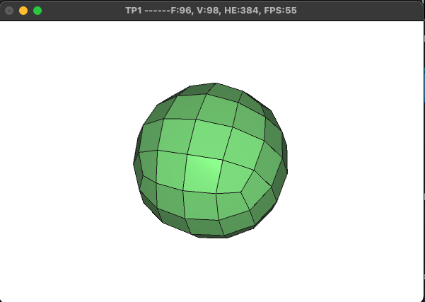
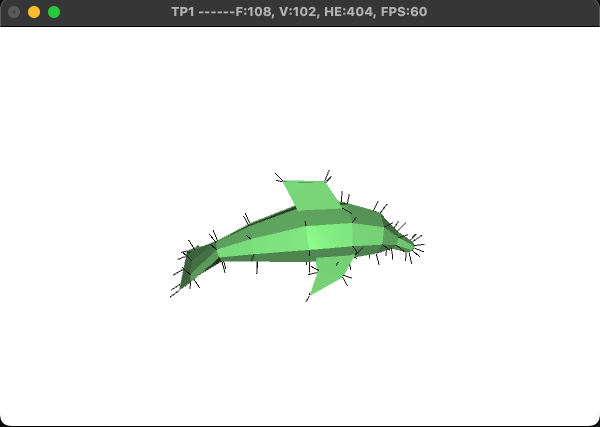
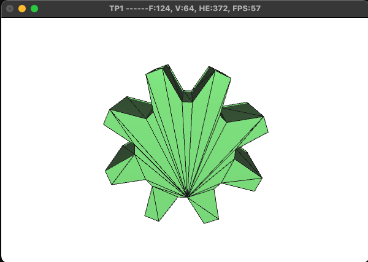
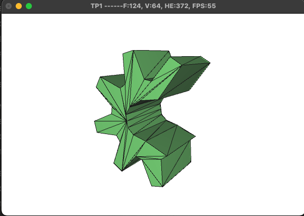
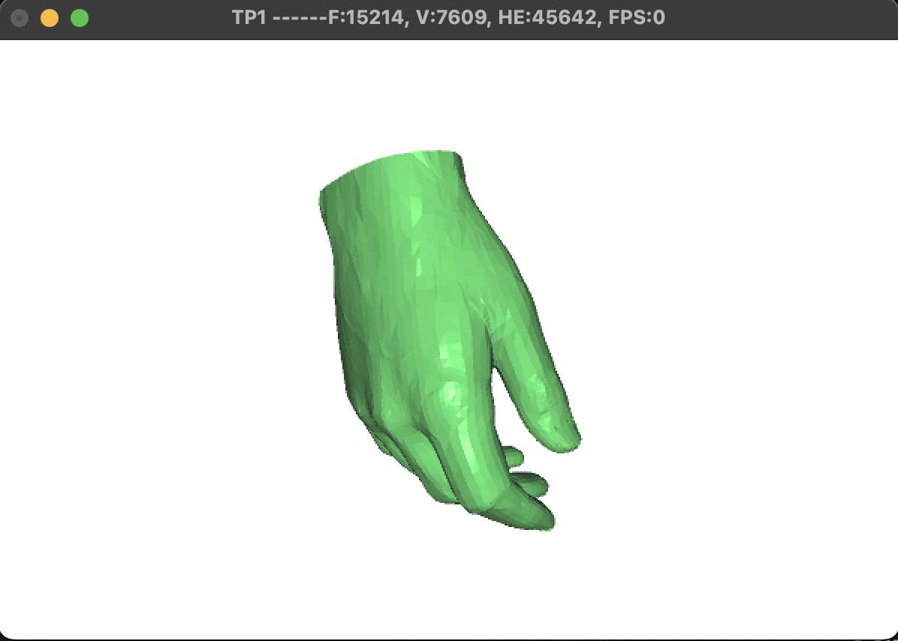
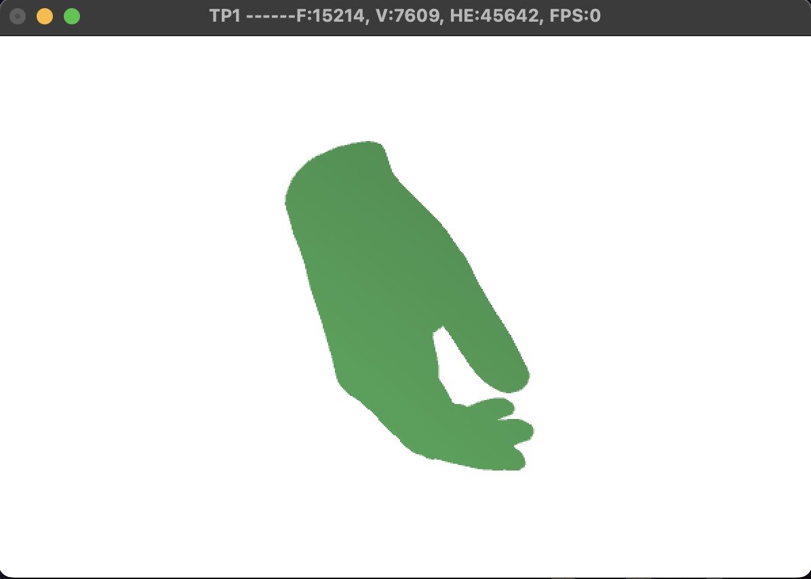
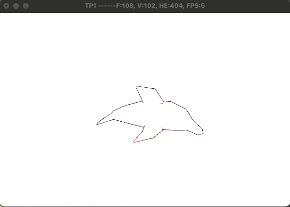
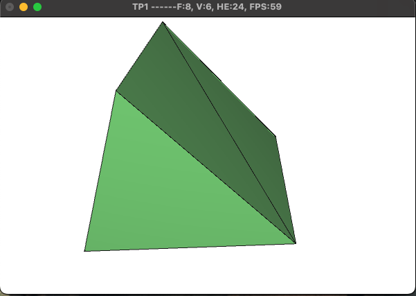
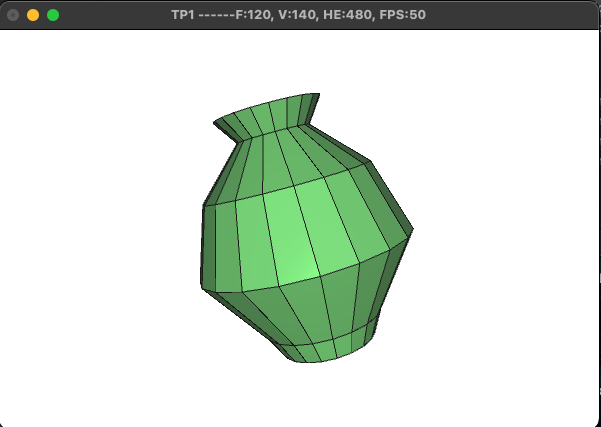

# Projet de Geometric Modeling

Ce projet consiste à implémenter une bibliothèque permettant de manipuler la structure half-edges. En passant par la simplification, la triangulation, la conversion d'uin .obj en une structure half-edges exploitable, l'implémentation de catmull-clark et plus.


## Tâches

Voici ce qui a été réalisé : 

1. [x] readFile : 

**Principe** : Prend en paramètre un object géométrique 3D de format .obj, et lit ligne par ligne ses entrées pour construire sa structure half-edges correspondante.
**Fonctionnement** : 
- Ouverture du .obj
- Lire les vertex lignes
- Créer la liste des faces, vertices et half-edges (en connectant next, prev, twin)
- Normalisation et lancement de tests

2. [x] computeNormals :

**Principe** : Calculer les normales des vertices et des faces. 
**Fonctionnement** : 
- Pour les faces, on calcul deux vecteurs AB et AC, et on réalise le produit vectoriel entre les deux pour trouver la normale résultante
- Pour les vertex, on somme les vertex autour de originof, et on moyenne le vecteur normal

3. [x] silhouette : 
**Principe : Trouver les arêtes frontières pour afficher la silhouette du mesh
**Fonctionnement** : 
- On parcourt toutes les halfedges, jusqu'à trouver les arêtes de contours (frontière), avec le test h->twin == nullptr
- A l'aide d'un produit scalaire pour déterminer quelle side entre sideA et sideB on veut afficher

3. [x] triangulation : 
**Principe** : La triangulation par ear-clipping de surfaces concaves et convexes
**Fonctionnement** : 
- On compte le nombre de sommets, si on en a 3, alors on a un triangle avec Vi, Vi-1 et Vi+1
- On utilise activeHalfedges, pour créer un tableau qui va stocker les he, et qui va se vider progressivement à mesure du earclip 
- On calcul l'areaNormal avec la méthode de newell
- On cherche une oreille avec le test d'inclusion (méthode barycentrique) et le test de convexité (produit vectoriel)
- On découpe l'oreille, en créant une diagonale et en la connectant
- On met a jour activeHalfedges en conséquence

4. [x] half-edge data structure tests (checkMesh) : 
**Principe** : Implémentation de tests dans la méthode checkMesh() afin de vérifier la cohérence globale
**Fonctionnement** : 
Voici les tests qui ont été implémenté (cf. cours) : 
- h->next->prev == h
- h->prev->next == h
- h != null
- h->next != null
- h->prev != null
- h->adjacent_face != null
- h->twin->twin == h
- h->source != null

Elle compte le nombre d'erreurs, et renvoie le résultat (succès ou échec)

Cette dernière est appelée à chaque fin d'opération géométrique, afin de s'assurer que la cohérence globale.

5. [x] surfaceRevolution : 
**Principe** : Génération d'une figure à partir d'un profil, on place des points autour de l'axe Z et on fait tourner
**Fonctionnement** : 
- On définit un profil de points en 2D représentant la silhouette verticale de l'objet
- On applique une rotation circulaire autour de l'axe Y pour dupliquer ce profil sur plusieurs tranches régulières
- On stocke tous les sommets générés dans une grille virtuelle pour conserver leur ordre géométrique
- On relie les sommets de la grille quatre par quatre pour former des rangées de faces quadrilatères
- On crée pour chaque face quatre demi-arêtes connectées en boucle fermée par des liens de parenté (suivant et précédent)
- On interconnecte toutes les faces adjacentes en liant les demi-arêtes qui se font face (les jumelles)

6. [x] simplify : 
**Principe** : Simplifier un mesh en détectant l'edge la plus courte et en collapse cette dernière. 30% des edges seront supprimées
**Fonctionnement** : 
- On définit un quota de réduction fixé à 30% du nombre total de sommets du maillage
- On parcourt toutes les arêtes pour calculer leur longueur géométrique en 3D
- On cherche l'arête la plus courte du maillage qui ne se trouve pas sur une bordure ouverte
- On fusionne les deux sommets de cette arête en un seul sommet positionné au milieu
- On supprime l'arête, sa jumelle, ainsi que les faces devenues superflues à cause de l'écrasement
- On répète cette opération de fusion en boucle jusqu'à atteindre le quota ou la limite de 4 sommets restants

7. [x] catmull-clark : implémentation de la méthode catmull-clark qui consiste à diviser les faces en quadrangles en cherchant le centre d'arêtes et de faces, puis lisser les points existants

- On calcule le centre géométrique de chaque face existante en faisant la moyenne de ses sommets
- On calcule un nouveau point au milieu de chaque arête en combinant ses sommets et le centre des faces adjacentes
- On applique un lissage mathématique sur la position des anciens sommets en les déplaçant légèrement vers leurs voisins
- On convertit tous ces centres (faces et arêtes) en de tout nouveaux sommets physiques ajoutés au maillage
- On découpe chaque ancienne face en plusieurs sous-faces à quatre côtés  en reliant les nouveaux points entre eux
- On recrée entièrement les demi-arêtes pour ces petits carrés et on les chaîne en boucle fermée
- On réalise la couture finale en reliant les demi-arêtes jumelles des carrés voisins pour unifier la surface
- On supprime l'ancienne structure géométrique et on met à jour les listes globales du modèle


## Usage de l'IA

Gemini a été utilisé lors de la réalisation des TPs afin de : 
- Le pseudo code je l'ai construit, comme décrit dans la section (Tâches) et j'ai essayé d'élaborer un algorithme, toutes les fonctions telles que std::map, make_pair, système d'indices (i+n)%k, formule de catmull-clark, tout ce qui était spécifique au C++ j'ai demandé à l'ia de me le réaliser
- Quand il y avait un plantage, j'ai demandé à l'IA de m'aider à résoudre, je me suis bien assuré de comprendre les attendus afin d'adapter le code à nos datastructures
- Pour les libérations de mémoires et le fait de supprimer les faces/points/demi-arêtes nécessaires afin de gérer la cohérence

Les codes générés explicitement par l'ia et intégré brut ont été marqué d'une balise (IA), certains ont pu être oublié mais globalement, computeNormals, silhouette, checkMesh, readFile ont été réalisé avec quasiment pas d'IA (seulement pour la détection de bugs). En revanche, triangulate, simplify et catmull-clark ont été réalisé avec la méthode pseudo code -> code -> aide IA. surfaceRevolution fonctionnait quasiment complétement, mais ne générait pas le résultat esconté et des problèmes de mémoires sont survenus.

Pour le debug, j'ai utilisé lldb afin de comprendre quelle ligne était fautive (de ce fait, j'ai compris que mes implémentations de readFile et computeNormals étaient parfois faussée). 

```
Protocole : 
lldb ./MeshViewer
run
thread backtrace
```


## Précisions

Le code a été commenté afin d'expliquer ce qui a été réalisé, au dessus de chaque fonction développée une section "Ce qui a été fait" est disponible à la lecture.

Un bouton "Surface of Revolution" est disponible dans le menu, il dessine un vase

Les TPs ont été réalisé avec un mac intel, des adaptations par rapport au squelette de base ont dû être réalisées notammene tdans le fichier CMakeLists.txt

L'ensemble des captures d'écrans sont disponibles dans le dossier screenshots

## Compilation du projet

1. Changer le fichier CMakeLists.txt en fonction de votre configuration
2. Se placer dans la racine, lancer cmake .
3. Compiler le projet avec make ./MeshViewer
4. Le lancer avec ./MeshViewer

## Résultats

Voici les résultats visuels : 

- Catmull clark sur un cube, deux itérations



- computeNormals sur dolphin



- Ear clipping sur gear



- Ear clipping sur c_gear



- Main avec le calcul des normales



- Main sans le calcul des normales



- Silhouette sur dolphin



- Simplify sur cube, 1 itération



- Surface de revolution avec le profil suivant : 
(profil ia)
```
 profile.push_back(myPoint3D(0.00, -0.50, 0.0)); 
    profile.push_back(myPoint3D(0.20, -0.50, 0.0));  
    profile.push_back(myPoint3D(0.25, -0.40, 0.0));  
    profile.push_back(myPoint3D(0.45, -0.10, 0.0));  
    profile.push_back(myPoint3D(0.35,  0.20, 0.0)); 
    profile.push_back(myPoint3D(0.15,  0.40, 0.0)); 
    profile.push_back(myPoint3D(0.22,  0.50, 0.0));  
```
